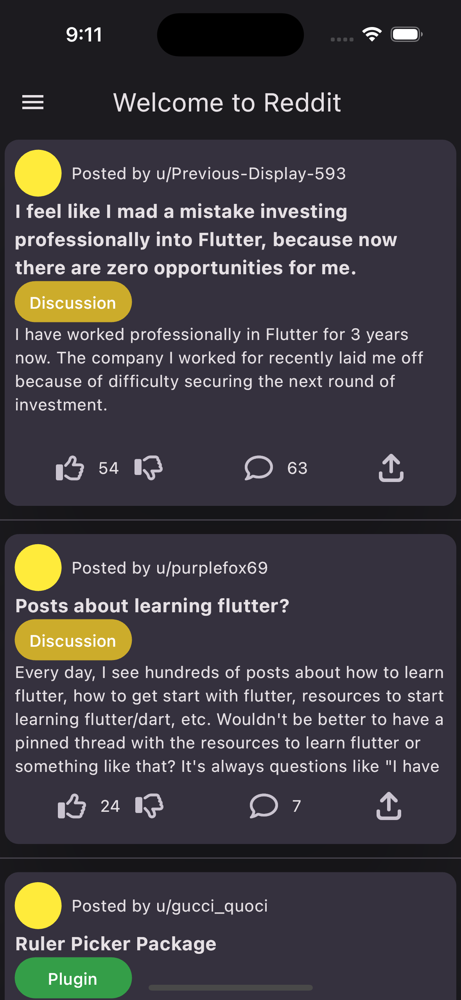
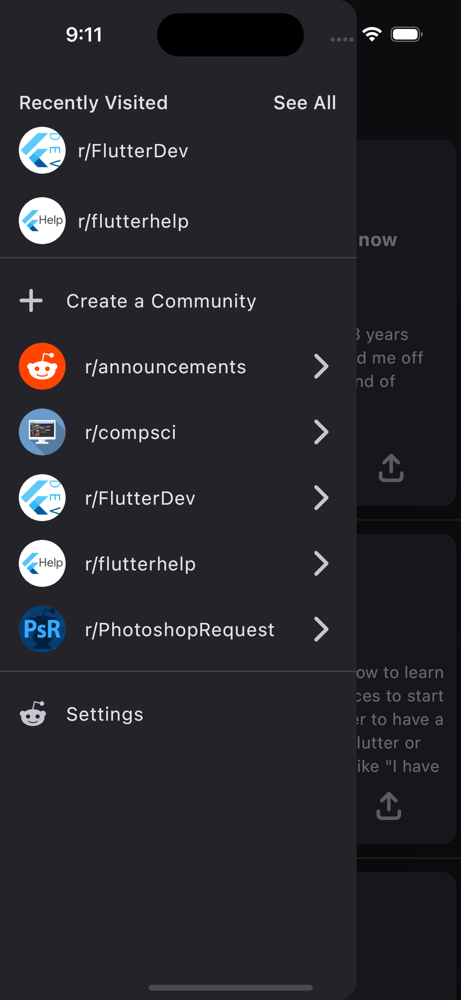
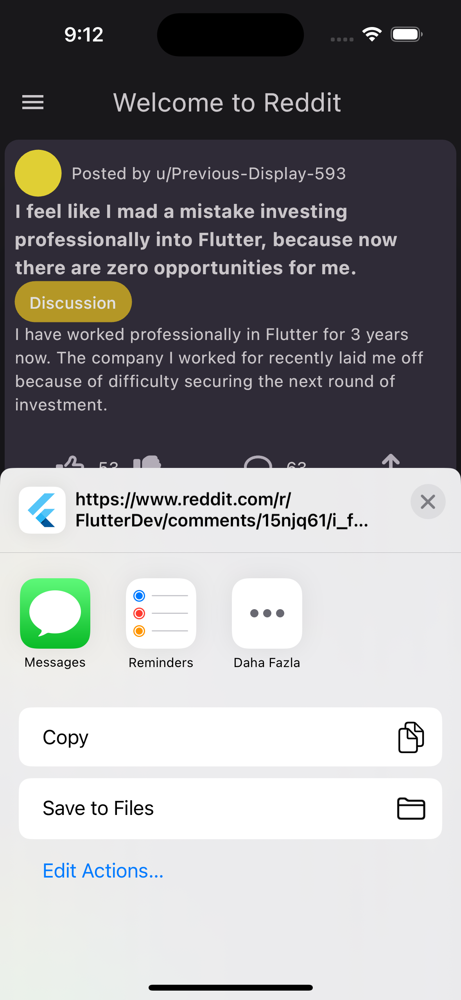

# Reddit Clone 
API =>
 [Reddit FlutterDev Top API](https://www.reddit.com/r/flutterdev/top.json?count=20) 

Bu proje, Flutter kullanılarak geliştirilen bir Reddit benzeri bir uygulamayı içermektedir. Uygulama, belirli bir API'den gelen verileri alır ve bu verileri Card widget'larıyla bir liste şeklinde görüntüler.

## Özellikler

- API'den gelen verileri Card widget'larıyla liste şeklinde düzenleme.
- Her bir kartta kullanıcı adı, başlık, açıklama ve kategori etiketi gösterimi.
- Kartlarda beğeni ve yorum sayısı görüntüleme.
- Kullanıcıların yeni gönderi paylaşma yeteneği.
- Kartlara beğenme ve yorum yapma işlevselliği.

## Kullanım

1. Uygulama başlatıldığında, API'den gelen veriler otomatik olarak yüklenecek ve Card widget'larıyla bir liste şeklinde görüntülenecektir.

2. Her bir kartta, kullanıcı adı, başlık, açıklama, kategori etiketi, beğeni sayısı ve yorum sayısı görüntülenecektir. Kullanıcılar kartlara tıklayarak daha fazla ayrıntıya ulaşabilirler.

3. Her bir kartın altında, beğenme ve yorum yapma düğmeleri bulunur. Kullanıcılar beğendiğinde veya yorum yaptığında, veriler pull to reflesh özelliği ile güncellenir.

This project involves developing a Reddit-like application using Flutter. The application fetches data from a specific API and displays this data in the form of Card widgets arranged in a list.

## Features
- Arranging data from the API in the form of a list using Card widgets.
- Displaying username, title, description, and category tag on each card.
- Displaying the number of likes and comments on the cards.
- Ability for users to make new posts.
- Functionality to like and comment on cards.

## Usage
1. When the application is launched, data from the API will be automatically loaded and displayed in a list using Card widgets.

2. Each card will display the username, title, description, category tag, number of likes, and number of comments. Users can tap on cards to access more details.

3. Beneath each card, there will be buttons for liking and commenting. When users like or comment, the data is updated using the pull-to-refresh feature.

- [LinkedIn](https://www.linkedin.com/in/vural-kayra-cetintas/)
- [Github](https://github.com/vuralkayracetintas)

  

    
    
     
Ana ekran, Drawer

  

  

  

  
  
  
Paylas, Detay

  

  
  
   
Like, Dislike 

  

## Kullanılan Paketler

- cupertino_icons: 
- equatable: 
- http: 
- flutter_bloc: 
- json_serializable: 
- flutter_color: 
- lottie: 
- kartal: 
- font_awesome_flutter: 
- url_launcher: 
- share_plus: 
- flutter_launcher_icons: 
